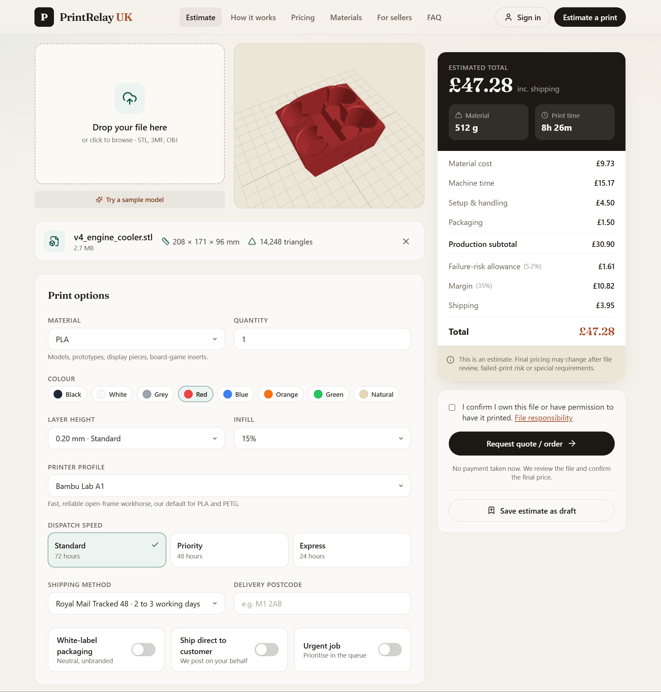
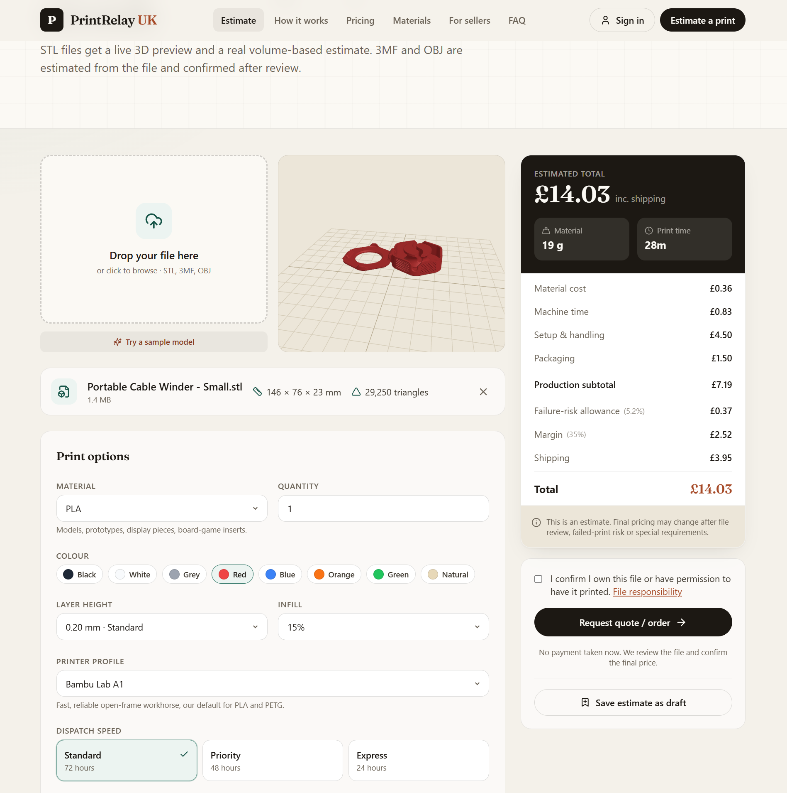

# PrintRelay UK 🇬🇧

**UK 3D printing service & overflow fulfilment — instant online quotes for sellers, makers and businesses.**

🌐 **Live site:** [PrintRelay UK](https://leonfxd200.github.io/PrintRelayUK/)

Upload one or more models, get an **instant 3D printing quote**, choose material (PLA, PETG, ABS, TPU) and dispatch speed, then track the job from quote to dispatch. A UK-based **online 3D printing service** with **white-label fulfilment** and transparent, itemised pricing.

> **Keywords:** 3D printing UK · online 3D printing service · instant 3D print quote · STL upload · PLA / PETG / ABS / TPU · print on demand · overflow & white-label fulfilment.

PrintRelay UK is a portfolio-quality React + Vite MVP for a fictional UK 3D printing overflow and fulfilment platform. It runs **immediately in demo mode** with realistic mock data, and is **structured to drop in Supabase** for real authentication, database storage and file uploads later.

> **Live demo logins** (password `demo` for all): `customer@printrelay.uk`, `seller@printrelay.uk`, `admin@printrelay.uk` — or use the one-click demo buttons on the sign-in page.

---

## Preview

The estimator can parse uploaded STL files, show a live 3D preview, read dimensions and triangle count, and produce a quote breakdown.

### Engine cooler STL



### Cable winder STL



---

## 💡 The business idea

3D printing sellers (Etsy / eBay / TikTok shops and print farms) regularly hit a wall: a product goes viral, a printer breaks mid-batch, or an order deadline is too tight for their own capacity. PrintRelay UK is their **backup print farm** — overflow capacity that prints, packs in **neutral / white-label packaging** and ships **direct to their customer**, so the seller's brand stays front and centre.

It also serves **everyday customers** who simply have an STL/3MF/OBJ file and want it printed quickly, with a transparent instant price.

**Two audiences, one platform:**

| Sellers & print farms | Makers & customers |
| --- | --- |
| Emergency overflow capacity | Instant, transparent estimate |
| Printer-breakdown cover | Live 3D STL preview |
| White-label, customer-direct dispatch | Choice of material, colour, quality |
| Batch & repeat-order support | Track from quote to dispatch |
| Saved seller preferences | Reorder previous jobs |

---

## ✨ Features

### Customer-facing
- **Instant multi-file estimator** with drag-and-drop upload (STL / 3MF / OBJ) — add **several parts in one order**, each with its own quantity, and get a single combined quote.
- **Real STL parsing** — binary *and* ASCII — computing genuine **mesh volume** and **bounding-box dimensions**, rendered live in an interactive **three.js** viewer.
- **Transparent price breakdown**: material, machine time, setup, packaging, failure-risk allowance, urgency fee, margin and shipping — every line itemised.
- **Print-time estimate** from a volumetric flow-rate model (clearly flagged as an estimate, not a slice).
- Material, colour, layer-height, infill, printer profile, quantity, dispatch speed, shipping method and postcode controls.
- White-label packaging, ship-direct and urgent toggles, with printer/material compatibility warnings.
- **Save any estimate as a draft** (lands in the dashboard) or request a quote — with a **File-responsibility confirmation** checkbox before submitting.

### Dashboards
- **Customer / seller dashboard**: active jobs, saved estimates, job history, animated **status timeline**, tracking numbers, one-click **reorder**, saved **print preferences** and **company / white-label settings**.
- **Admin / operations dashboard**: KPI cards (jobs this week, urgent jobs, estimated revenue, average print hours, top material, queue capacity), **jobs-by-status** and **material-demand** charts, a searchable/filterable **print queue**, and full per-job editing — change status, assign printer, edit price, add tracking, add quote notes, mark issue / dispatched / complete, and view file metadata.

### Platform
- 12 pages incl. Home, Estimator, How it works, Pricing, Materials, Seller / white-label, FAQ, File responsibility, Contact, Auth and 404.
- Demo authentication with role-based routing (customer / seller / admin) and protected routes.
- Polished UX throughout: loading, empty and success states, form validation, status badges, animated quote results, responsive mobile nav and footer.
- **Demo mode** banner and a **Reset demo data** button (data persists in `localStorage`).

### Engineering notes
- **Privacy-first:** no third-party requests at all — no font CDN, analytics or trackers. Uploaded files are parsed **in the browser** and never transmitted (`file_url` stays `null`); the app runs fully offline.
- **Code-split 3D viewer:** three.js is lazy-loaded only on the estimator, so every other page loads ~123 KB (gzipped) lighter.
- **Resilient:** an error boundary wraps the routes (and the 3D viewer) so a bad file or render error shows a friendly fallback instead of a blank screen.
- **Accessible:** keyboard-operable upload zone, native selects, focus-visible rings and `aria` states on custom controls.
- **SEO-ready:** descriptive title + meta description per route, Open Graph / Twitter cards, a branded social image, JSON-LD structured data (Organization / WebSite / Service), `robots.txt`, `sitemap.xml` and a canonical URL.

---

## 🛠️ Tech stack

- **React 18** + **Vite 5**
- **React Router 6** (HashRouter — zero-config static hosting)
- **Tailwind CSS 3** (custom electric-blue / slate industrial design system)
- **Framer Motion** for transitions & micro-interactions
- **three.js** for the STL preview
- **lucide-react** icons
- **@supabase/supabase-js** (wired up, optional — falls back to mock mode)

Deliberately **few, well-known dependencies** — nothing exotic to maintain.

---

## 🚀 Run it locally

```bash
# 1. Install dependencies
npm install

# 2. Start the dev server
npm run dev
# → http://localhost:5173
```

No environment variables are required — the app runs in **demo mode** out of the box.

### Build for production

```bash
npm run build      # outputs to dist/
npm run preview    # preview the production build locally
```

---

## 📂 Project structure

> **Developers:** see [`docs/ARCHITECTURE.md`](docs/ARCHITECTURE.md) for how the
> pieces fit together (routing, the mock-data/Supabase swap seam, and the
> estimator pipeline).

```
src/
├── components/
│   ├── layout/        Navbar, Footer, Layout (app shell)
│   ├── ui/            Reusable primitives (Field, StatusBadge, PageHeader…)
│   ├── home/          Hero pieces incl. animated JobStatusPreview
│   ├── estimator/     ModelViewer (three.js), QuoteBreakdown
│   ├── dashboard/     JobCard (customer)
│   └── admin/         StatCard, BarChart, AdminJobRow (editable)
├── context/
│   └── AuthContext.jsx   Demo auth (Supabase-ready method signatures)
├── data/              Mock data: printers, materials, options, statuses,
│                      sample jobs, demo users & preferences
├── lib/
│   ├── supabaseClient.js  Reads env vars; null in demo mode
│   └── mockDb.js          Async data layer (swappable for Supabase queries)
├── pages/             12 routed pages
├── utils/
│   ├── estimatePrintCost.js   The cost + time engine (tunable constants)
│   ├── stl.js                 Binary + ASCII STL parser (volume & dims)
│   ├── colours.js / format.js Helpers
│   └── …
├── App.jsx            Routes + route guards
└── main.jsx           Entry (HashRouter + AuthProvider)
```

---

## 🧮 How the estimate works

The estimator is a **transparent approximation**, not a slicer/editor. All business constants live at the top of [`src/utils/estimatePrintCost.js`](src/utils/estimatePrintCost.js) so pricing is trivial to tune.

**Material usage**
```
materialFraction = shellAllowance + infill% × (1 − shellAllowance)
extrudedVolume   = modelVolume × materialFraction
grams            = extrudedVolume(cm³) × density(g/cm³) × quantity
```

**Print time** (volumetric model)
```
seconds = (extrudedVolume_mm³ / printerFlowRate) × qualityFactor × overhead
qualityFactor = referenceLayerHeight / chosenLayerHeight   (finer = slower)
hours   = (seconds × quantity) / 3600 + setupHours
```

**Price**
```
materialCost   = grams/1000 × spoolCostPerKg
machineCost    = hours × printerHourlyRate
subtotal       = materialCost + machineCost + setupFee + packaging
failureRisk    = subtotal × (baseRisk × materialDifficulty / printerReliability)
urgencyFee     = subtotal × (dispatchUrgency + urgentToggle)
margin         = subtotal × marginRate
total          = subtotal + failureRisk + urgencyFee + margin + shipping
```

For **STL** files the model volume is computed exactly from the mesh (signed-tetrahedron sum). For **3MF / OBJ**, volume is estimated from file size and the UI flags it as confirmed-after-review.

---

## 🔌 Going live with Supabase (future)

The app is built so you can switch from mock mode to a real backend **without changing component code** — only [`src/lib/mockDb.js`](src/lib/mockDb.js) needs its functions re-pointed at Supabase (each one already documents its query equivalent).

1. **Create a Supabase project** at [supabase.com](https://supabase.com).
2. **Add environment variables** — copy `.env.example` to `.env`:
   ```env
   VITE_SUPABASE_URL=https://YOUR-PROJECT.supabase.co
   VITE_SUPABASE_ANON_KEY=YOUR-ANON-KEY
   ```
   When both are present, [`supabaseClient.js`](src/lib/supabaseClient.js) creates a real client and `isSupabaseConfigured` flips to `true`. If absent, the app stays in demo mode.
3. **Create the tables** (suggested schema):

   ```sql
   -- profiles
   create table profiles (
     id uuid primary key references auth.users on delete cascade,
     full_name text, company_name text, email text,
     role text check (role in ('customer','seller','admin')) default 'customer',
     business_type text, created_at timestamptz default now()
   );

   -- jobs
   create table jobs (
     id text primary key, user_id uuid references profiles(id),
     file_name text, file_url text, file_size bigint,
     material text, colour text, layer_height numeric, infill int,
     printer_profile text, quantity int, dispatch_speed text,
     white_label bool, ship_direct bool, urgent bool,
     shipping_method text, postcode text,
     estimated_grams numeric, estimated_hours numeric,
     estimated_material_cost numeric, estimated_machine_cost numeric,
     estimated_total numeric, status text, tracking_number text,
     admin_notes text,
     created_at timestamptz default now(), updated_at timestamptz default now()
   );

   -- saved_preferences
   create table saved_preferences (
     id uuid primary key default gen_random_uuid(),
     user_id uuid references profiles(id),
     material text, layer_height numeric, infill int,
     printer_profile text, dispatch_speed text,
     white_label_default bool, created_at timestamptz default now()
   );

   -- messages
   create table messages (
     id uuid primary key default gen_random_uuid(),
     job_id text references jobs(id), user_id uuid references profiles(id),
     message text, created_at timestamptz default now()
   );
   ```
4. **Create a public storage bucket** named `print-files` for uploads.
5. **Enable Row Level Security** so customers only see their own jobs and admins see everything.
6. Swap the bodies of the functions in `mockDb.js` and the auth methods in `AuthContext.jsx` for the documented Supabase calls.

---

## 🌐 Deploy to GitHub Pages

The app uses a **HashRouter** and `base: './'`, so it works on GitHub Pages with no extra redirect/404 config.

1. Push the project to a GitHub repo (e.g. `printrelay-uk`).
2. The repo already includes `gh-pages` and a deploy script:
   ```bash
   npm run deploy
   ```
   This builds to `dist/` and publishes it to the `gh-pages` branch.
3. In your repo: **Settings → Pages → Source: `gh-pages` branch** (root).
4. Your site goes live at `https://<your-username>.github.io/<repo-name>/`.

> If you deploy to a custom domain at the root, you can change `base` to `'/'` in `vite.config.js`.

You can also deploy the `dist/` folder to **Netlify**, **Vercel** or **Cloudflare Pages** by pointing them at `npm run build`.

---

## 🔎 Repository discoverability (GitHub topics)

To help people find this project on GitHub, add a short **About** description and
**topics** in the repo (GitHub → repo home → ⚙️ *Edit repository details*). Suggested:

> **About:** UK 3D printing service & overflow fulfilment — React + Vite app with an instant multi-file STL quote estimator.

> **Topics:** `3d-printing` `3d-printing-service` `react` `vite` `tailwindcss`
> `threejs` `stl` `stl-viewer` `quote-estimator` `uk` `manufacturing`
> `print-on-demand` `web-app` `portfolio-project`

These (plus the keyword-rich README and SEO meta above) are what GitHub and search
engines index, so they directly improve the chance of the project being found.

## 🔭 Future improvements

- Real Supabase auth, database, RLS and file uploads (schema above).
- Payments (Stripe) once a quote is confirmed.
- Real slicer integration (e.g. PrusaSlicer / OrcaSlicer CLI) for exact time/material instead of an estimate.
- 3MF / OBJ parsing for live previews of those formats.
- Email/SMS notifications on status changes; tracking webhooks from couriers.
- Admin photo uploads at quality-check (admin-only by design — customers cannot upload final print photos).
- Seller API + webhook so shops can push orders automatically.
- Optional finishing services (sanding / painting) by request — print-only for the MVP.

---

## ⚖️ File responsibility (summary)

Customers confirm they own each uploaded file or have permission to print it. PrintRelay UK does **not** claim ownership, and files are used **only** to quote, print and fulfil that specific order — never reused, resold, shared or printed for anyone else. Files that appear unsafe, illegal, weapon-related, explicit or copyrighted/branded without permission may be rejected. See the in-app **File responsibility** page.

---

## 📝 Notes

- This is a **demonstration MVP** for portfolio use — no real payments, printing or shipping occur.
- All data in demo mode lives in your browser's `localStorage`; use **Reset demo data** on the admin dashboard to restore the seeded samples.

---

*Built with React, Vite, Tailwind, Framer Motion and three.js.*
